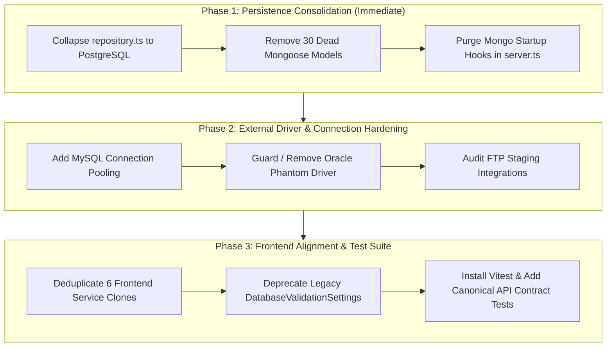

# Forward Modification Plan Assessment & Roadmap

> **Target Repository**: Operational Workflow Management Platform  
> **Evaluated Document**: `forward_modification_plan.md`  
> **Governance References**: [`.agents/skills/bo-operational-governance/SKILL.md`](file:///c:/Users/hp/Downloads/opration-workflow-mangement1/.agents/skills/bo-operational-governance/SKILL.md) & [`CURRENT_PROJECT_CONTEXT.md`](file:///c:/Users/hp/Downloads/opration-workflow-mangement1/CURRENT_PROJECT_CONTEXT.md)  
> **Date**: September 2026

---

## 1. Executive Summary & Verdict

The provided **Forward Modification Plan** is architecturally well-conceived and aligns firmly with core repository governance:
- **PostgreSQL is the single source of truth** (not MongoDB or in-memory arrays).
- **Validation Verdicts** (`PASS`, `FAIL`, `ERROR`, `PAUSED_DB_OFFLINE`) remain distinct from **Pipeline Actions** (`CONTINUE`, `STOP`, `CLOSE`, `FLAG`, `REPORT`).
- **External Reconciliation** relies on typed UNLOGGED mirror tables (`mirror_{db}_{table}`) and batched SQL projections.

### Summary Scorecard

| Assessment Dimension | Rating | Analysis |
| :--- | :---: | :--- |
| **Governance & Architectural Intent** | **9.5 / 10** | Directly reflects mandatory back-office operational standards and relational persistence. |
| **Domain Lifecycle Modeling** | **9.0 / 10** | Accurately emphasizes stage-aware execution and verdict/action segregation. |
| **Implementation Specificity** | **5.5 / 10** | High-level themes lack concrete file references, code-level hotspots, and explicit bug callouts. |
| **Risk & Dependency Identification** | **5.0 / 10** | Omits phantom database drivers, unpooled MySQL connections, and active dead-code bloat. |
| **Execution Feasibility** | **8.0 / 10** | Logical progression, but needs explicit gating between persistence refactoring and UI alignment. |
| **Overall Verdict** | **7.4 / 10** | **Strong strategic foundation; requires concrete operational and file-level grounding.** |

---

## 2. Granular Section Analysis

### Item 1: Persistence and Repository Routing Standardization
* **Plan Proposal**: Unify persistence under PostgreSQL across [`backend/src/store/repository.ts`](file:///c:/Users/hp/Downloads/opration-workflow-mangement1/backend/src/store/repository.ts), reducing legacy in-memory and MongoDB fallback paths.
* **Grounded Assessment**: **CRITICAL PRIORITY.**
  - `repository.ts` is currently ~1,300 lines of complex triple-fallback code (`PostgresRepo` → `MongoRepo` → `InMemoryRepo`).
  - `.env` does not supply a MongoDB URI; MongoDB connection failures log warnings on every startup.
  - **Missing from Plan**: Does not call out the **30 dead Mongoose models** in `backend/src/models/` or the unnecessary `connectDB()` / `seedDatabase()` invocations in [`backend/src/server.ts`](file:///c:/Users/hp/Downloads/opration-workflow-mangement1/backend/src/server.ts) (lines 90–91).
  - **Remediation**: Collapse `repository.ts` into a lightweight delegate to [`backend/src/store/postgresRepo.ts`](file:///c:/Users/hp/Downloads/opration-workflow-mangement1/backend/src/store/postgresRepo.ts) (~200 lines).

---

### Item 2: Workflow and Validation-Box Contract Alignment
* **Plan Proposal**: Align API route payloads in [`backend/src/routes/workflows.ts`](file:///c:/Users/hp/Downloads/opration-workflow-mangement1/backend/src/routes/workflows.ts) and [`backend/src/routes/validationBoxes.ts`](file:///c:/Users/hp/Downloads/opration-workflow-mangement1/backend/src/routes/validationBoxes.ts) with relational storage schemas.
* **Grounded Assessment**: **HIGH IMPORTANCE.**
  - **Missing from Plan**: Mismatched status tracking. `statusAggregator.ts` was previously querying for invalid status strings (`RECONCILED`, `FLAGGED`, `INVESTIGATING`) instead of the canonical `InvestigationStatus` enum (`VERIFIED_MATCH`, `FLAGGED_DISCREPANCY`, `IN_PROGRESS`).
  - **Missing from Plan**: Complete duplication of core business logic between backend and frontend (6 duplicated service files across `backend/src/services/` and `frontend/src/services/`).

---

### Item 3: Validation Result and Pipeline Action Separation
* **Plan Proposal**: Maintain strict separation between rule discovery verdicts (`PASS`, `FAIL`, etc.) and orchestration decisions (`CONTINUE`, `STOP`, etc.) across [`backend/src/services/workflowEngineSingleton.ts`](file:///c:/Users/hp/Downloads/opration-workflow-mangement1/backend/src/services/workflowEngineSingleton.ts) and [`backend/src/services/investigationOrchestratorService.ts`](file:///c:/Users/hp/Downloads/opration-workflow-mangement1/backend/src/services/investigationOrchestratorService.ts).
* **Grounded Assessment**: **GOVERNANCE MANDATE.**
  - **Missing from Plan**: Concrete bug in [`backend/src/services/reconciliationService.ts`](file:///c:/Users/hp/Downloads/opration-workflow-mangement1/backend/src/services/reconciliationService.ts). In both the PostgreSQL mirror-table path and the fallback in-memory path, actions were hardcoded strings (`'CONTINUE'` on match, `'STOP'` on mismatch), ignoring user-configured `onPassAction` / `onFailAction`. *(This was resolved during our recent refactor)*.

---

### Item 4: External Source Mapping and Driver Discipline
* **Plan Proposal**: Enforce metadata-driven dynamic queries via `global_standard_directory` and batched `WHERE id IN (...)` projections in [`backend/src/routes/database.ts`](file:///c:/Users/hp/Downloads/opration-workflow-mangement1/backend/src/routes/database.ts).
* **Grounded Assessment**: **VITAL, BUT OMITS PRODUCTION CRASH HAZARDS.**
  - **The "Oracle Phantom"**: `'Oracle'` is listed as a valid `DatabaseConnection.type` in [`backend/src/types.ts`](file:///c:/Users/hp/Downloads/opration-workflow-mangement1/backend/src/types.ts), but `oracledb` is not in `package.json`. Connecting to an Oracle database triggers an uncaught module crash.
  - **MySQL Connection Leak**: In [`backend/src/services/dbConnectionManager.ts`](file:///c:/Users/hp/Downloads/opration-workflow-mangement1/backend/src/services/dbConnectionManager.ts), MySQL runs `mysql2.createConnection()` per query chunk without connection pooling (`createPool()`), creating socket exhaustion under high batch loads.

---

### Item 5: Mirror-Table Lifecycle Governance
* **Plan Proposal**: Govern the creation, population, and refresh of UNLOGGED mirror tables in [`backend/src/services/mirrorTableManager.ts`](file:///c:/Users/hp/Downloads/opration-workflow-mangement1/backend/src/services/mirrorTableManager.ts).
* **Grounded Assessment**: **ACCURATE DIRECTION.**
  - **Missing from Plan**: The **table accumulation / leak issue**. Previously, tables were created via `CREATE UNLOGGED TABLE IF NOT EXISTS mirror_{db}_{table}`, but there was no teardown mechanism, no row TTL, and no batch clearing on workflow completion. *(Resolved via newly implemented `cleanupMirrorBatch` and `clearTableCache`)*.

---

### Item 6: Execution Discipline and Stage Awareness
* **Plan Proposal**: Preserve flowchart DAG execution order, pipeline stages, and execution envelopes in [`backend/src/services/workflowEngineSingleton.ts`](file:///c:/Users/hp/Downloads/opration-workflow-mangement1/backend/src/services/workflowEngineSingleton.ts).
* **Grounded Assessment**: **ACCURATE DIRECTION.**
  - **Missing from Plan**: Key-chaining breakage. When an investigation traversed multiple stages, downstream foreign keys were resolved using hardcoded string heuristics (`id`, `transaction_id`, `reference`) rather than consulting the stage's configured `QueryExtraction.keyMappings`. *(Resolved via repository key mapping lookup)*.

---

### Item 7: Frontend and Backend Contract Synchronization
* **Plan Proposal**: Align React/Vite workflow models with backend schemas to eliminate UI state drift.
* **Grounded Assessment**: **ACCURATE DIRECTION.**
  - **Missing from Plan**: UI fragmentation. Two distinct rule-building interfaces coexist in the frontend:
    1. Legacy monolithic `DatabaseValidationSettings.tsx` (136 KB).
    2. Flowchart DAG Studio `WorkflowStudioFlowchart.tsx` (74 KB).
    The plan must explicitly decommission or deprecate the legacy view to avoid user confusion.
  - **Missing from Plan**: Client-side UI freezing in `IssueCreator.tsx` when parsing Excel sheets containing >10,000 rows on the main browser thread.

---

### Item 8: Regression Testing Around the Contract Boundary
* **Plan Proposal**: Add integration test coverage across route endpoints and PostgreSQL repository interactions.
* **Grounded Assessment**: **CRITICAL ENABLER.**
  - **Missing from Plan**: The repository has no test runner or harness installed (`vitest` / `jest` are missing from `devDependencies`). The plan needs to specify the test framework and continuous integration script.

---

## 3. Grounded Comparison Table

| Plan Theme | Stated Proposal | Codebase Grounded Reality | Current Resolution Status |
| :--- | :--- | :--- | :--- |
| **Health Check** | *(Not identified)* | Health endpoint advertised MongoDB instead of active PostgreSQL | **Fixed** (`server.ts`) |
| **Pipeline Action** | Preserve verdict vs. action distinction | `reconciliationService.ts` hardcoded actions to `'CONTINUE'`/`'STOP'` | **Fixed** (`reconciliationService.ts`) |
| **Status Enums** | Preserve business status | `statusAggregator.ts` queried wrong status strings (`RECONCILED`) | **Fixed** (`backend` & `frontend`) |
| **Key Chaining** | Stage-aware workflow execution | Skipped `keyMappings`, relied on static string fallbacks | **Fixed** (`investigationOrchestratorService.ts`) |
| **Mirror Lifecycle** | Mirror table governance | Tables accumulated indefinitely with no cleanup routine | **Fixed** (`mirrorTableManager.ts`) |
| **Repository Layer** | Standardize persistence to PG | 1,300 lines of dead MongoDB/in-memory fallback & 30 unused models | **Ready for Execution** |
| **Database Drivers** | Enforce driver discipline | Phantom Oracle driver & unpooled MySQL connection allocations | **Ready for Execution** |
| **Service Clones** | Align UI & backend models | 6 duplicated engine files across frontend and backend | **Ready for Execution** |
| **Test Coverage** | Add contract regression tests | No test runner configured in repository | **Ready for Execution** |

---

## 4. Prioritized Forward Execution Roadmap

To convert the conceptual plan into an executable, low-risk sequence, work should proceed across three disciplined phases:

### Phase 1: Persistence Consolidation & Dead Scaffolding Removal
1. **Refactor [`backend/src/store/repository.ts`](file:///c:/Users/hp/Downloads/opration-workflow-mangement1/backend/src/store/repository.ts)**:
   - Eliminate in-memory and MongoDB class branches.
   - Forward all `IRepository` operations directly to [`backend/src/store/postgresRepo.ts`](file:///c:/Users/hp/Downloads/opration-workflow-mangement1/backend/src/store/postgresRepo.ts).
2. **Decommission MongoDB Dependencies**:
   - Delete unused Mongoose schemas in `backend/src/models/` (30 files).
   - Remove `connectDB()` and `seedDatabase()` invocations from `backend/src/server.ts`.
   - Remove `mongoose` from `backend/package.json`.

### Phase 2: External Driver & Connection Hardening
1. **MySQL Pooling in [`backend/src/services/dbConnectionManager.ts`](file:///c:/Users/hp/Downloads/opration-workflow-mangement1/backend/src/services/dbConnectionManager.ts)**:
   - Replace per-query `mysql2.createConnection()` with a managed `mysql2.createPool()`.
2. **Oracle Driver Guard in [`backend/src/types.ts`](file:///c:/Users/hp/Downloads/opration-workflow-mangement1/backend/src/types.ts)**:
   - Either isolate `Oracle` behind a dynamic plugin check with explicit UI messaging, or prune it from the supported database types until native binaries are provisioned.

### Phase 3: Frontend Deduplication, UI Consolidation & Testing
1. **Deduplicate Frontend Engines**:
   - Retire the duplicated files in `frontend/src/services/` (`investigationEngine.ts`, `batchPlanner.ts`, `investigationPlanner.ts`, etc.) and route operations to backend endpoints.
2. **UI Simplification**:
   - Add deprecation warnings to `DatabaseValidationSettings.tsx` and direct all workflow rule configuration to `WorkflowStudioFlowchart.tsx`.
3. **Automated Contract Suite**:
   - Configure `vitest` in `backend/package.json`.
   - Implement end-to-end integration tests for `/api/workflows`, `/api/validation-boxes`, and external mirror table execution against PostgreSQL.
