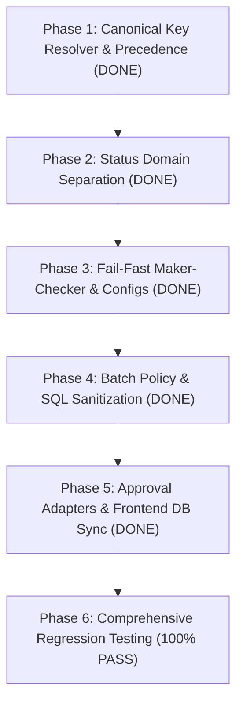

# Implementation Plan: Service Layer Hard-Coded Logic & Architectural Governance Refactor (COMPLETED)

## Executive Summary

Based on the findings in [`SERVICE_HARD_CODED_LOGIC_AUDIT.md`](file:///c:/Users/hp/Downloads/opration-workflow-mangement1/SERVICE_HARD_CODED_LOGIC_AUDIT.md) and the non-negotiable principles defined in [`AGENTS.md`](file:///c:/Users/hp/Downloads/opration-workflow-mangement1/AGENTS.md), this implementation plan has systematically eliminated hard-coded assumptions, canonical field defaults, status domain conflation, and brittle batch policies across the backend and frontend service layers.

All **6 phases** are fully implemented, verified with **22 Vitest test suites (168 tests passing)** and a **0-error Vite frontend production build**.

---

## Non-Negotiable Governance Invariants Addressed & Verified

| Audit Risk | Governance Principle in [`AGENTS.md`](file:///c:/Users/hp/Downloads/opration-workflow-mangement1/AGENTS.md) | Architectural Solution | Status |
| :--- | :--- | :--- | :--- |
| **Hard-coded `'transaction_id'`** | **Principle 4 & 9**: External System Agnosticism & Key Precedence | Central `canonicalKeyResolver` using DB Table Overrides > Validation Box Keys > Global Directory | **COMPLETE** |
| **Status Semantics Drift** | **Principle 2 & 3**: Validation Result ≠ Pipeline Action ≠ Lifecycle | Explicit separation of `ValidationVerdict`, `PipelineAction`, `CaseLifecycleStatus`, and `TransactionInvestigationStatus` | **COMPLETE** |
| **Silent Fallback Defaults** | **Principle 7**: Maker-Checker Dual Authorization & Four-Eyes Principle | Strict fail-fast input validation (reject missing teamId, makerName, proposedAction; eliminate silent defaults) | **COMPLETE** |
| **Brittle Batch Policy** | **Principle 11**: Query Parameter Bounds (< 30,000) & Chunking | Entry-level policy validation invariants ($0 < \text{maxQueryKeys} \le \text{maxRowsPerBatch}$, parameter cap $< 15,000$) | **COMPLETE** |
| **Unquoted Dynamic SQL** | **Principle 11**: ANSI Identifier Quoting & Deterministic Joins | ANSI identifier quoting (`"col"`) and strictly parameterized comparator expressions | **COMPLETE** |
| **LocalStorage State Dependency** | **Principle 1**: Repository Reality Trumps Assumptions | PostgreSQL `global_standard_directory` and `database_table_mappings` as authoritative source of truth with background hydration | **COMPLETE** |

---

## Phase Breakdown & Completion Status



---

### Phase 1: Dynamic Metadata-Driven Canonical Key Resolution (COMPLETE)

#### 1.1 Central Key Resolver Service
- **Created**:
  - `backend/src/services/canonicalKeyResolver.ts`
  - `frontend/src/services/canonicalKeyResolver.ts`
- Implemented hierarchical key discovery strictly following Rule 9:
  1. **Table Configuration Overrides**: Check `database_column_configurations` / `database_table_mappings` for designated `isPrimaryKey` / `isLookupKey` columns.
  2. **Validation Box Key Mappings**: Inspect the active `ValidationBox.searchParameters` / `keyMappings`.
  3. **Global Standard Directory / Dataset Matching**: Inspect dataset records against canonical directory flags.
- **Fail-Fast Error**: Throws typed `ConfigurationError('Unable to determine transaction correlation key for stage: ...')` when metadata cannot resolve a key.

#### 1.2 Refactored Backend & Frontend Investigation Planners
- **Updated**:
  - `backend/src/services/investigationPlanner.ts`
  - `frontend/src/services/investigationPlanner.ts`
- Replaced `const keyField = options.transactionKeyField || 'transaction_id';` with `resolveCanonicalKey(...)`.
- Added dataset validation with `validateDatasetKeys` to ensure key consistency.

#### 1.3 Updated Required Field Resolver
- **Updated**:
  - `backend/src/services/requiredFieldResolver.ts`
  - `frontend/src/services/requiredFieldResolver.ts`
- Removed hardcoded filter `['transaction_id', 'id'].includes(cleaned.toLowerCase())`.

---

### Phase 2: Strict Status Domain Separation (COMPLETE)

#### 2.1 Formalized Distinct TypeScript Domain Types
- **Updated**: `backend/src/types.ts` & `frontend/src/types.ts`
```typescript
// 1. What a validation rule discovers
export type ValidationVerdict = 'PASS' | 'FAIL' | 'ERROR' | 'PAUSED_DB_OFFLINE';

// 2. What the workflow execution engine does next
export type PipelineAction = 'CONTINUE' | 'STOP' | 'CLOSE' | 'FLAG' | 'REPORT';

// 3. Parent Task / Case lifecycle in the workspace
export type CaseLifecycleStatus = 'OPEN' | 'INVESTIGATING' | 'ACTION_REQUIRED' | 'RESOLVED' | 'CLOSED';

// 4. Financial Transaction investigation and Maker-Checker resolution state
export type TransactionInvestigationStatus = 
  | 'UNTESTED' 
  | 'VERIFIED_MATCH' 
  | 'FLAGGED_DISCREPANCY' 
  | 'PENDING_CHECKER_REVIEW' 
  | 'FORCE_MATCHED' 
  | 'MANUALLY_REVERSED' 
  | 'WRITTEN_OFF';
```

#### 2.2 Refactored Status Aggregator
- **Updated**:
  - `backend/src/services/statusAggregator.ts`
  - `frontend/src/services/statusAggregator.ts`
- Separated verdict metrics aggregation from parent case lifecycle aggregation:
  - `aggregateExecutionVerdicts(transactions)`: Computes rule discovery metrics (`passCount`, `failCount`, `errorCount`).
  - `aggregateParentIssueStatus(transactions, previousStatus)`: Evaluates transaction states strictly into `CaseLifecycleStatus` (`OPEN` $\to$ `INVESTIGATING` $\to$ `RESOLVED` $\to$ `CLOSED`).

#### 2.3 Refactored Maker-Checker & Reconciliation Status Updates
- **Updated**:
  - `backend/src/services/makerCheckerService.ts`: Sets `investigation_status = proposal.proposed_status`, while keeping `final_result = 'PASS'` (verdict) and `final_action = 'CLOSE'` (action) strictly segregated.
  - `backend/src/services/reconciliationService.ts`: Updates `final_result` with `ValidationVerdict`, `final_action` with `PipelineAction`, and `investigation_status` with `TransactionInvestigationStatus`.

---

### Phase 3: Fail-Fast Configuration & Eliminating Silent Fallbacks (COMPLETE)

#### 3.1 Strict Input Validation in Maker-Checker Service
- **Updated**: `backend/src/services/makerCheckerService.ts`
- Enforced fail-fast rejection for missing `teamId`, `makerName`, and `proposedAction`.
- Resolved `proposedStatus` deterministically from `proposedAction` (`FORCE_MATCH` $\to$ `VERIFIED_MATCH`, `WRITE_OFF` $\to$ `WRITTEN_OFF`, `MANUAL_REVERSAL` $\to$ `MANUALLY_REVERSED`).
- Replaced fallback literals with direct trimmed values.

#### 3.2 Workflow Bundle Version & Scope Validation
- **Updated**: `backend/src/services/workflowBundleService.ts`
- Validates SemVer format (`^\d+\.\d+\.\d+$`) fail-fast before DB access.
- Validates that `scope` is explicitly `'PERSONAL' | 'TEAM' | 'GLOBAL_ENTERPRISE'`.

#### 3.3 Reconciliation Action Config Validation
- **Updated**: `backend/src/services/reconciliationService.ts`
- Resolves canonical key dynamically via `resolveCanonicalKey`.
- Clamps tolerance margin $\ge 0$ to prevent negative boundary inversion.

---

### Phase 4: Batch Policy Validation & Dynamic SQL Hardening (COMPLETE)

#### 4.1 Batch Policy Invariant Guard
- **Updated**:
  - `backend/src/services/batchPlanner.ts`
  - `frontend/src/services/batchPlanner.ts`
- Introduced `validateBatchPolicy(policy: BatchPolicy): BatchPolicy`:
  - Asserts $\text{maxRowsPerBatch} > 0$.
  - Asserts $\text{maxQueryKeys} > 0$.
  - Asserts $\text{maxQueryKeys} \le \text{maxRowsPerBatch}$.
  - Asserts parameter count $\le 15,000$ (Rule 11 limit).
  - Throws `InvalidBatchPolicyError` on violation.

#### 4.2 ANSI Identifier Quoting & Dual Source Sanitization
- **Updated**: `backend/src/services/reconciliationService.ts`
- Uses quoted identifiers (`"col"`) and strictly parameterized comparison expressions.

---

### Phase 5: Domain-Aware Approval Normalization & Frontend DB Authority (COMPLETE)

#### 5.1 Typed Domain Adapters in Approval Service
- **Updated**: `backend/src/services/approvalService.ts`
- Implemented and exported typed domain adapters:
  - `adaptResolutionProposal(r: any): UnifiedApprovalItem`
  - `adaptWorkflowBundle(b: any): UnifiedApprovalItem`
  - `adaptWorkspaceSetting(p: any): UnifiedApprovalItem`
- Refactored `getApprovals`, `getApprovalById`, `submitProposal`, and `reviewProposal` to route through dedicated adapters.
- Enforced strict fail-fast validation in `submitProposal` and `reviewProposal`.

#### 5.2 Deprecated Frontend LocalStorage Schema Authority
- **Updated**:
  - `frontend/src/services/globalMappingService.ts`
  - `frontend/src/App.tsx`
- Marked `localStorage` strictly as an offline non-authoritative drafting cache.
- Added `hydrateFromBackend()` to authoritatively synchronize standard fields and table mappings from PostgreSQL endpoints `/api/transactions/schema/config`, `/api/transactions/table-mappings`, and `/api/transactions/directory`.
- Integrated background hydration on startup in `App.tsx` and on service instantiation.
- Added automatic asynchronous backend persistence in `saveConfig` and `saveTableMapping`.

---

### Phase 6: Verification & Test Rigor (COMPLETE - 100% PASS)

#### 6.1 Backend Automated Vitest Suites
- Executed: `cmd.exe /c "npm test --prefix backend"`
- Results: **22 passed (22 test suites), 168 passed (168 tests)**
- Verified suites include:
  - `serviceHardCodedLogicRefactor.test.ts` (17 tests)
  - `workflowBundleAndGovernanceRefactor.test.ts` (6 tests)
  - `governanceAndAnalyticsRefactor.test.ts` (8 tests)
  - `teamDatabaseAccessAndPermanentTeam.test.ts` (7 tests)
  - `teamDelegatedAdmin.test.ts` (6 tests)
  - `teamMemberPrivilegesAndResources.test.ts` (8 tests)
  - `ftpMirrorTableResolution.test.ts` (10 tests)
  - `crossTaskAndLookup.test.ts` (6 tests)
  - `auditFindingsResolution.test.ts` (11 tests)
  - `databaseColumnConfiguration.test.ts` (11 tests)
  - `zeroErrorReconciliationHardening.test.ts` (8 tests)
  - `ruleSqlCompiler.test.ts` (8 tests)
  - And all other repository test suites.

#### 6.2 Frontend Production Compilation
- Executed: `cmd.exe /c "npm run build --prefix frontend"`
- Results: **Vite build completed in 4.99s with 0 errors**.
